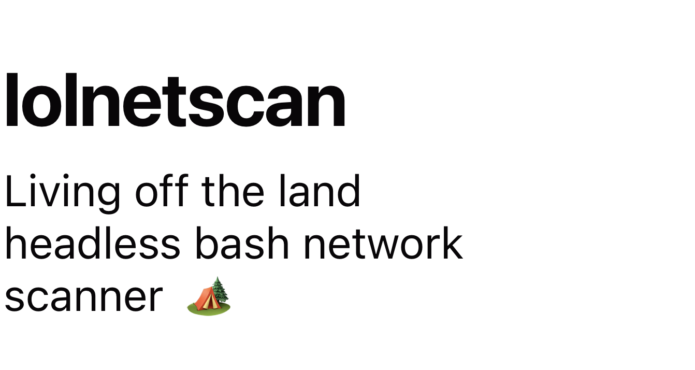

## Overview

`lolnetscan` is a simple yet powerful network scanner written in Bash. It allows you to scan hosts for open ports using TCP or UDP protocols. The tool is designed to be lightweight and efficient, making it useful for various network scanning tasks.

## Features

The benefits of using `lolnetscan` in penetration testing include:

1. **Stealthy Reconnaissance**: The script leverages common Linux utilities and basic network commands, making it less likely to raise suspicions during a security assessment.
2. **Minimizes Footprint**: Since it uses existing tools and features, there's no need to upload additional scanning tools, minimizing the digital footprint on the target system.
3. **Quick Assessment**: The script allows for quick assessment of live hosts and open ports, enabling penetration testers to focus on further exploitation.
4. **Customization**: Penetration testers can modify the script according to their specific requirements and add features as needed.
5. **Resource-Friendly**: The script is lightweight and doesn't require extensive system resources, making it suitable for low-resource environments.
6. **Learning Experience**: Developing and using a custom script like this can enhance the penetration tester's understanding of network scanning techniques and bash scripting.

## Usage

To scan for open ports on one or more target hosts, run the `lolnetscan.sh` script with the appropriate options:

```bash
./lolnetscan.sh -host <target> [-p <ports>] [-u]
```

Options:
- `-host <target>`: Specify the target host(s) using comma, dash, or CIDR notation.
- `-p <ports>`: Specify the port number(s) using comma or dash.
- `-u`: Use UDP protocol for port scanning (default is TCP).

For example, to scan TCP ports 80 and 443 on hosts `192.168.0.1` and `192.168.0.2`, use:

```bash
./lolnetscan.sh -host 192.168.0.1,192.168.0.2 -p 80,443
```

> Port range separated by dash also supported 

To scan UDP ports 53, 123, and 161 on a range of hosts, use:

```bash
./lolnetscan.sh -host 192.168.0.1-192.168.0.10 -p 53,123,161 -u
```

> CIDR notation also supported (Ex: 192.168.0.1/24)

## Running Directly from GitHub

You can run the `lolnetscan` script directly from GitHub without downloading or installing it on the target system. Use the following one-liner command:

```bash
bash <(curl -sSL https://raw.githubusercontent.com/ousbaailyas/lolnetscan/master/lolnetscan) -host <target> [-p <ports>] [-u]
```

## Or

Installing it

```bash
git clone https://github.com/ousbaailyas/lolnetscan
chmod +x lolnetscan/lolnetscan
lolnetscan/lolnetscan  -host <target> [-p <ports>] [-u]
```

## Sample Output

Here's an example of the output you may see while running the script:

```bash
[INF] Host 192.168.0.1 is alive
[INF] Open TCP port 192.168.0.1:80
[INF] Closed or filtered UDP port 192.168.0.1:443
```

## Notes

- This tool uses the `bash` shell's built-in `/dev/tcp` feature for TCP or `netcat` for UDP protocols without using `ping`.
- Option to discover live hosts without port enumeration using `ping`

## License

This project is licensed under the [MIT License](LICENSE).

## Contributions

Contributions are welcome! If you find any issues or want to add features or improvements, feel free to create a pull request.
